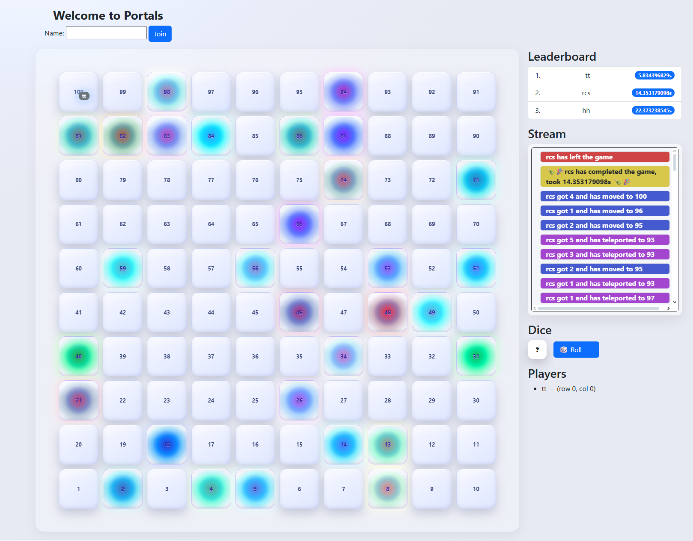

# Portals

## How to run

- clone the the repo
- I hope you have installed golang in your system
- run `go mod tidy`, it should install all the packages
- run `air`, and enjoy the game

## How the Game actually looks

